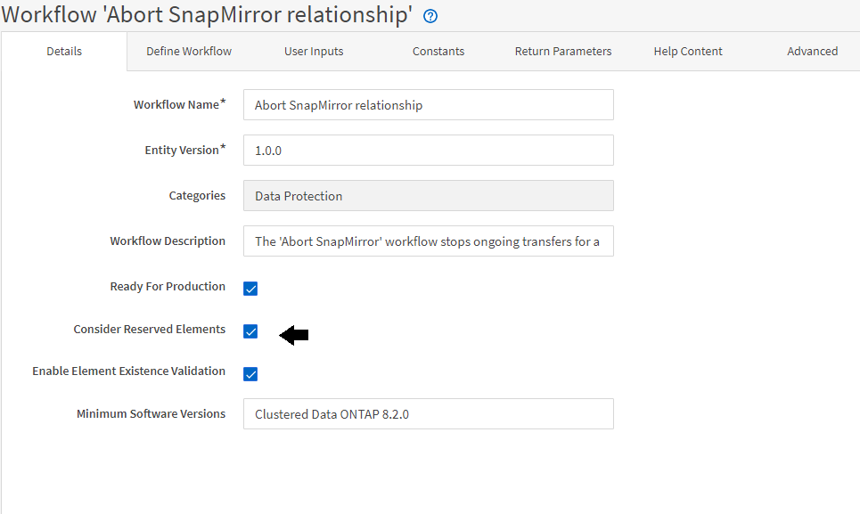

= 預約如何運作
:allow-uri-read: 
:icons: font
:imagesdir: ../media/

[role="lead"]
支援的資源保留功能會保留所需的資源、以確保資源可用於成功執行工作流程。OnCommand Workflow Automation

WFA命令可保留必要的資源、並在WFA快取資料庫中提供資源後移除保留區、通常是在取得快取之後。保留功能可確保保留的資源可用於工作流程、直到您在WFA組態設定中設定的保留到期期間為止。

您可以使用保留功能、在資源選取期間排除其他工作流程保留的資源。例如、如果某個工作流程在某個Aggregate上保留100 GB空間、則排定在一週後執行、 您正在執行另一個使用「*建立Volume *」命令的工作流程、執行的工作流程不會佔用排程工作流程所保留的空間來建立新的Volume。此外、保留功能可讓工作流程平行執行。

預覽工作流程以供執行時、WFA規劃人員會考量所有保留的物件、包括快取資料庫中的現有物件。如果您已啟用保留、則在規劃工作流程時、會考慮排程工作流程和平行執行的工作流程的影響、以及儲存元素的存在。

下圖中的箭頭顯示已啟用工作流程的保留：

== 預先定義工作流程中的保留範例

您可以在Designer中開啟下列預先定義的工作流程、以瞭解如何使用預約：

* 複製環境
* 建立叢集Data ONTAP 式的流通量
* 建立叢集對等關係
* 移除叢集Data ONTAP 式的「叢集式」功能

