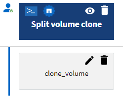

= 哪些是核准點
:allow-uri-read: 
:icons: font
:imagesdir: ../media/

[role="lead"]
核准點是工作流程中用來暫停工作流程執行、並根據使用者核准而繼續執行的檢查點。

下圖所示的藍色垂直列是核准點：

您可以使用核准點來遞增執行工作流程、在符合特定條件後才執行工作流程的各部分。例如、當必須核准下一節或驗證第一節的成功執行時。核准點不會處理暫停與恢復工作流程之間的任何程序。如WFA組態所指定、系統會傳送電子郵件和SNMP通知、並在收到工作流程暫停通知時要求儲存操作員執行某些動作。例如、儲存設備營運者可將規劃詳細資料傳送給管理員、核准者或營運者以供核准、並在收到核准後繼續工作流程。

可能不一定需要核准。在某些情況下、只有在符合特定條件、且新增核准點時、才能設定條件時、才需要核准。例如、請考慮專為增加磁碟區大小而設計的工作流程。您可以在工作流程開始時新增核准點、以便儲存操作員在磁碟區大小增加時、將包含磁碟區的集合體空間使用率提高85%、即可取得經理的核准。在工作流程執行期間以及選取導致此情況的磁碟區時、執行會停止、直到核准為止。

為核准點設定的條件可以有下列其中一個選項：

* 無任何條件
* 找到您指定的變數時
* 找不到您指定的變數
* 當您指定的運算式評估為true時

工作流程中的核准點數量沒有限制。您可以在工作流程中的命令之前插入核准點、並將核准點之後的命令設定為在執行之前等待核准。核准點提供變更時間、使用者和註解等資訊、可讓您查看工作流程執行暫停或恢復的時間和原因。核准點註解可以包含VEL運算式。

== 預先定義工作流程中的核准點範例

您可以在Designer中開啟下列預先定義的工作流程、以瞭解如何使用核准點：

* 移除叢集Data ONTAP 式的「叢集式」功能
* HA配對的控制器和機櫃升級
* 移轉Volume

