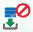

= 「目錄」視窗
:allow-uri-read: 
:icons: font
:imagesdir: ../media/

[role="lead"]
「字典」視窗會依字母順序顯示可用的字典項目。

字典項目是OnCommand Workflow Automation 指由支援的物件類型（WFA）定義。每個字典項目都代表物件類型及其在儲存設備和儲存設備相關環境中的關係。在資料庫中、會將字典項目轉換為表格。

NOTE: 視您的角色和帳戶權限而定、可能不會顯示此視窗。

== dictionary表格

「字典」表格會列出可用的字典項目。每個項目均識別為下列其中一項：

* image:../media/community_certification.gif[""] -使用者建立的內容
* image:../media/ps_certified_icon_wfa.gif[""] 由專業服務（PS）開發的內容、僅適用於PS所製作的自訂安裝
* image:../media/community_certification.gif[""] -由使用者開發的套件
* image:../media/lock_icon_wfa.gif[""] -由鎖定的使用者所建立的內容
* image:../media/netapp_certified.gif[""] - NetApp認證內容

您可以使用各欄可用的篩選和排序功能、以及重新排列欄順序、來自訂表格顯示。

* image:../media/filter_icon_wfa.gif["篩選圖示"] 啟用或停用整個表格的篩選。如果停用篩選功能、圖示上會出現紅色的「x」。
* 按兩下 image:../media/filter_icon_wfa.gif["篩選圖示"] 清除並重設篩選選項。
* image:../media/wfa_filter_icon.gif["篩選圖示"] 在每個欄標題上、您都可以根據欄的內容進行篩選。按一下 image:../media/wfa_filter_icon.gif["篩選圖示"] 欄中的可讓您篩選下拉式清單或所有可用項目的特定項目。
* 按一下欄標題、即可切換遞增或遞減排序順序。您可以使用排序箭頭來識別套用的排序順序（image:../media/wfa_sortarrow_up_icon.gif["排序圖示"] 用於遞增和 image:../media/wfa_sortarrow_down_icon.gif["向下排序圖示"] 降序）。
* 若要重新排列欄位的位置、您可以拖放欄位、以任何所需的順序排列欄位。不過、您無法隱藏或刪除這些欄。
* 按一下「*搜尋*篩選」文字方塊、即可搜尋特定內容。此外、您也可以使用支援的運算子來搜尋適用的欄類型、字母或數字。

「Dictionary」表格包含下列欄位：

* *認證*
+
指出是否使用者建立了該字典項目（image:../media/community_certification.gif[""]）、PS（image:../media/ps_certified_icon_wfa.gif[""]）、社群（image:../media/community_certification.gif[""]）、使用者鎖定（image:../media/lock_icon_wfa.gif[""]）、或NetApp認證的（image:../media/netapp_certified.gif[""]）。

* *名稱*
+
顯示該字典項目的名稱。

* *方案*
+
顯示與字典項目相關的配置。方案是包含與環境相關資料的一組字典項目。（例如、某個虛擬機器配置包含與虛擬環境相關的資料、例如虛擬機器、主機和資料存放區。）

* *實體版本*
+
以「major.m2.m輕.reversion」格式顯示物件的版本編號、例如1.1.0。

* *說明*
+
顯示字典項目的說明。

* *已啟用擷取*
+
顯示啟用資料擷取的字典項目核取標記。

* *上次更新日期*
+
顯示上次更新字典項目的日期和時間。

* *更新者*
+
顯示更新該字典項目的使用者名稱。

* *鎖定者*
+
顯示鎖定字典項目的使用者名稱。

* *天然關鍵*
+
顯示與字典項目相關的自然金鑰。

== 工具列

工具列位於欄標題上方。您可以使用工具列中的圖示來執行各種動作。您也可以從視窗中的滑鼠右鍵功能表存取這些動作。

* *image:../media/new_wfa_icon.gif["新圖示"] （新版）*
+
開啟「新增字典項目」視窗、可讓您建立新的字典項目。

* *image:../media/edit_wfa_icon.gif["編輯圖示"] （編輯）*
+
開啟所選字典項目的「Dictionary EntryName>」視窗、讓您編輯該字典項目。

* *image:../media/clone_wfa_icon.gif["複製圖示"] （複製）*
+
開啟「新增字典項目」<EntryName>_copy視窗、可讓您建立所選字典項目的複本。

* *image:../media/lock_wfa_icon.gif["鎖定圖示"] （鎖定）*
+
開啟「鎖定字典項目」確認對話方塊、可讓您鎖定選取的字典項目。

+
此選項只會針對您所建立的字典項目啟用。

* *image:../media/unlock_wfa_icon.gif["解除鎖定圖示"] （解除鎖定）*
+
開啟「解除鎖定字典項目」確認對話方塊、可讓您解除鎖定所選的字典項目。

+
此選項只會針對您已鎖定的字典項目啟用。系統管理員可以解除鎖定其他使用者鎖定的字典項目。

* *image:../media/delete_wfa_icon.gif["刪除圖示"] （刪除）*
+
開啟刪除字典項目確認對話方塊、可讓您刪除選取的使用者建立的字典項目。

+

NOTE: 您無法刪除WFA字典項目或PS字典項目。

* *image:../media/export_wfa_icon.gif["匯出圖示"] （匯出）*
+
可讓您匯出選取的使用者建立的字典項目。

+

NOTE: 您無法匯出WFA字典項目或PS字典項目。

* * （啟用擷取）*
+
提供選項以啟用所選字典項目的快取擷取。

* * （停用擷取）*
+
可讓您停用所選字典項目的快取擷取功能。

* *image:../media/reset_scheme_wfa_icon.gif["重設配置圖示"] （重設方案）*
+
可讓您重設與所選的字典項目相關的配置。

* *image:../media/add_to_pack.png["新增至套件圖示"] （新增至套件）*
+
開啟「新增至套件字典」對話方塊、可讓您將字典項目及其可靠的實體新增至可編輯的套件。

+

NOTE: 「新增至套件」功能只會針對認證設為*無的目錄項目啟用。*

* *image:../media/remove_from_pack.png["從套件移除圖示"] （從套件中移除）*
+
開啟所選字典項目的「從套件移除字典」對話方塊、可讓您從套件中刪除或移除該字典項目。

+

NOTE: 「從套件移除」功能只會針對認證設為*無的字典項目啟用。*

* * （庫存）*
+
開啟所選字典項目的「庫存」對話方塊、可讓您查看表格資料。

