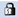
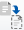

= 篩選器視窗
:allow-uri-read: 
:icons: font
:imagesdir: ../media/

[role="lead"]
篩選器視窗會依字母順序顯示可用的篩選器。您可以選取*工作流程設計*>*篩選器*來存取此視窗。

NOTE: 視您的角色和帳戶權限而定、可能不會顯示此視窗。

篩選器是查詢規則、可在查詢型搜尋尋找資源時移除不相關的資源。篩選器用於開發尋找工具。

* 篩選表
* 工具列

== 篩選表

「篩選」表格會列出可用的篩選條件。每個項目均識別為下列其中一項：

* image:../media/community_certification.gif[""] -使用者建立的內容
* image:../media/ps_certified_icon_wfa.gif[""] 由專業服務（PS）開發的內容、僅適用於PS所製作的自訂安裝
* image:../media/community_certification.gif[""] -由使用者開發的套件
*  -由鎖定的使用者所建立的內容
* image:../media/netapp_certified.gif[""] - NetApp認證內容

您可以使用各欄可用的篩選和排序功能、以及重新排列欄順序、來自訂表格顯示。

*  啟用或停用整個表格的篩選。如果停用篩選功能、圖示上會出現紅色的「x」。
* 按兩下  清除並重設篩選選項。
* image:../media/wfa_filter_icon.gif["篩選圖示"] 在每個欄標題上、您都可以根據欄的內容進行篩選。按一下 image:../media/wfa_filter_icon.gif["篩選圖示"] 欄中的可讓您篩選下拉式清單或所有可用項目的特定項目。
* 按一下欄標題、即可切換遞增或遞減排序順序。您可以使用排序箭頭來識別套用的排序順序（ 用於遞增和  降序）。
* 若要重新排列欄位的位置、您可以拖放欄位、以任何所需的順序排列欄位。不過、您無法隱藏或刪除這些欄。
* 按一下「*搜尋*篩選」文字方塊、即可搜尋特定內容。此外、您也可以使用支援的運算子來搜尋適用的欄類型、字母或數字。

「篩選」表格包含下列欄位：

* *認證*
+
表示篩選器是否為使用者建立的（image:../media/community_certification.gif[""]）、PS（image:../media/ps_certified_icon_wfa.gif[""]）、社群（image:../media/community_certification.gif[""]）、使用者鎖定（）、或NetApp認證的（image:../media/netapp_certified.gif[""]）。

+
您可以從篩選清單中選取一或多個核取方塊、以搜尋篩選條件。

* *名稱*
+
顯示篩選器的名稱。

+
您可以在「搜尋篩選」文字方塊中輸入篩選名稱、以搜尋篩選條件。

* *方案*
+
顯示與篩選器相關的配置。方案代表系統的資料模型。例如、某個虛擬機器配置包含與虛擬環境相關的資料、例如虛擬機器、主機和資料存放區。

+
您可以在「搜尋篩選器」文字方塊中輸入篩選條件、以搜尋篩選條件。

* *類型*
+
顯示篩選器的字典物件類型（例如Aggregate Array或CIFS）。

+
您可以在「搜尋篩選」文字方塊中輸入類型、以搜尋篩選條件。

* *實體版本*
+
以「major.m2.m輕.reversion」格式顯示物件的版本編號、例如1.1.0。

+
您可以在「搜尋篩選」文字方塊中輸入版本編號、以搜尋篩選條件。

* *說明*
+
顯示篩選器的說明。

+
您可以在「搜尋篩選」文字方塊中輸入篩選條件的說明、以搜尋篩選條件。

* *上次更新日期*
+
顯示上次更新篩選器的日期和時間。

+
您可以從篩選下拉式清單中選取時間類別、以搜尋篩選條件。

* *更新者*
+
顯示更新篩選器的使用者。

+
您可以在「搜尋篩選」文字方塊中輸入使用者名稱、以搜尋篩選條件。

* *鎖定者*
+
顯示鎖定篩選器的使用者。

+
您可以在「搜尋篩選」文字方塊中輸入使用者名稱、以搜尋篩選條件。

== 工具列

工具列位於欄標題上方。您可以使用工具列中的圖示來執行各種動作。您也可以從視窗中的滑鼠右鍵功能表存取這些動作。

* *image:../media/new_wfa_icon.gif["新圖示"] （新版）*
+
開啟「新增篩選」視窗、可讓您建立篩選條件。

* * （編輯）*
+
開啟所選篩選器的篩選器<filter（篩選器）名稱>視窗、讓您編輯篩選器。

+
您也可以按兩下篩選條件以開啟「編輯篩選條件」視窗。

* * （複製）*
+
開啟「新篩選器」<filter（篩選器名稱）>_copy（複製）視窗、可讓您建立所選篩選器的複本。

* * （鎖定）*
+
開啟「鎖定篩選器」確認對話方塊、可讓您鎖定選取的篩選器。

* * （解除鎖定）*
+
開啟「解除篩選器鎖定」確認對話方塊、可讓您解除鎖定選取的篩選器。

+
此選項只會針對您已鎖定的篩選條件啟用。系統管理員可以解除鎖定其他使用者鎖定的篩選器。

* * （刪除）*
+
開啟「刪除篩選器」確認對話方塊、可讓您刪除選取的使用者建立篩選器。

+

NOTE: 您無法刪除WFA篩選器、PS篩選器或範例篩選器。

* *image:../media/export_wfa_icon.gif["匯出圖示"] （匯出）*
+
可讓您匯出選取的使用者建立篩選器。

+

NOTE: 您無法匯出WFA篩選器、PS篩選器或範例篩選器。

* * （測試）*
+
開啟「測試篩選器」對話方塊、可讓您測試選取的篩選器。

* * （新增至套件）*
+
開啟「新增至套件篩選」對話方塊、可讓您將篩選及其可靠的實體新增至可編輯的套件。

+

NOTE: 「新增至套件」功能僅會針對認證設為「無」的篩選器啟用。

* * （從套件中移除）*
+
開啟所選篩選器的「從套件中移除篩選器」對話方塊、可讓您從套件中刪除或移除篩選器。

+

NOTE: 「從套件移除」功能只會針對認證設為「無」的篩選器啟用。

