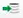

= 套件視窗
:allow-uri-read: 
:icons: font
:imagesdir: ../media/

[role="lead"]
「套件」視窗會顯示OnCommand Workflow Automation 已匯入且可在WFA伺服器中使用的RWFA套件。每個套件都包含套件資訊檔案和WFA內容、例如工作流程、命令、篩選器、功能、 和範本。

* 套件表格
* 工具列

== 套件表格

「套件」表格以表格格式列出WFA伺服器中可用的WFA套件。您可以使用各欄可用的篩選和排序功能、以及重新排列欄順序、來自訂表格顯示。

* image:../media/filter_icon_wfa.gif["篩選圖示"] 啟用或停用整個表格的篩選。如果停用篩選功能、圖示上會出現紅色的「x」。
* 按兩下 image:../media/filter_icon_wfa.gif["篩選圖示"] 清除並重設篩選選項。
* image:../media/wfa_filter_icon.gif["篩選圖示"] 在每個欄標題上、您都可以根據欄的內容進行篩選。按一下 image:../media/wfa_filter_icon.gif["篩選圖示"] 欄中的可讓您篩選下拉式清單或所有可用項目的特定項目。
* 按一下欄標題、即可切換遞增或遞減排序順序。您可以使用排序箭頭來識別套用的排序順序（image:../media/wfa_sortarrow_up_icon.gif["排序圖示"] 用於遞增和 image:../media/wfa_sortarrow_down_icon.gif["向下排序圖示"] 降序）。
* 若要重新排列欄位的位置、您可以拖放欄位、以任何所需的順序排列欄位。不過、您無法隱藏或刪除這些欄。
* 按一下「*搜尋*篩選」文字方塊、即可搜尋特定內容。此外、您也可以使用支援的運算子來搜尋適用的欄類型、字母或數字。

「套件」表格包含下列欄位：

* *認證*
+
指出套件是否為使用者建立的（image:../media/community_certification.gif[""]）、PS（image:../media/ps_certified_icon_wfa.gif[""]）、社群（image:../media/community_certification.gif[""]）、使用者鎖定（image:../media/lock_icon_wfa.gif[""]）、或NetApp認證的（image:../media/netapp_certified.gif[""]）

+
您可以從篩選清單中選取所需的選項核取方塊來搜尋藥品包。

* *名稱*
+
顯示套件名稱。

+
您可以在*搜尋*篩選條件文字方塊中輸入套件名稱、以搜尋套件。

* *說明*
+
顯示套件說明。

+
您可以在「*搜尋*篩選」文字方塊中輸入套件說明、以搜尋套件。

* *實體版本*
+
以「major.m2.m輕.reversion」格式顯示套件的版本編號、例如1.1.0。

* *上次更新日期*
+
顯示更新套件的日期和時間。

+
您可以從篩選下拉式清單中選取所需的時間類別、以搜尋藥品包。

* *更新者*
+
顯示更新套件的使用者名稱。

+
您可以在*搜尋*篩選條件文字方塊中輸入使用者名稱、以搜尋套件。

* *詳細資料*
+
在Storage Automation Store網站中顯示套件的詳細資料。

== 工具列

工具列位於欄標題上方。您可以使用工具列中的圖示來執行各種動作。您也可以從視窗中的滑鼠右鍵功能表存取這些動作。

* *（新版）*
+
開啟「新增套件」對話方塊、可讓您建立新套件。

* * （編輯）*
+
開啟「Pack內容」對話方塊、其中包含下列索引標籤、以取得有關套件內容的詳細資訊：

+
** 工作流程
** 尋找者
** 篩選器
** 命令
** 功能
** 範本
** 字典
** 方案
** 快取查詢
** SQL資料來源類型
** 指令碼資料來源類型
** 遠端系統類型
** 類別

* *image:../media/delete_wfa_icon.gif["刪除圖示"] （刪除）*
+
開啟「刪除套件」確認對話方塊、可讓您刪除所選的套件。

* *image:../media/unlock_wfa_icon.gif["解除鎖定圖示"] （解除鎖定）*
+
開啟「解除鎖定藥品包」確認對話方塊、可讓您解除鎖定所選的藥品包。此選項僅針對您鎖定的套件啟用。不過、系統管理員可以解除鎖定其他使用者鎖定的套件。

* *image:../media/export_wfa_icon.gif["匯出圖示"] （匯出）*
+
開啟匯出對話方塊、可讓您匯出所選的套件。

* * （從伺服器資料夾匯入）*
+
開啟「從伺服器資料夾匯入」對話方塊、可讓您從伺服器系統中選取的資料夾位置匯入套件。

* * （匯出至伺服器資料夾）*
+
開啟「匯出至伺服器資料夾」對話方塊、可讓您將套件匯出至伺服器系統中所選的資料夾位置。

