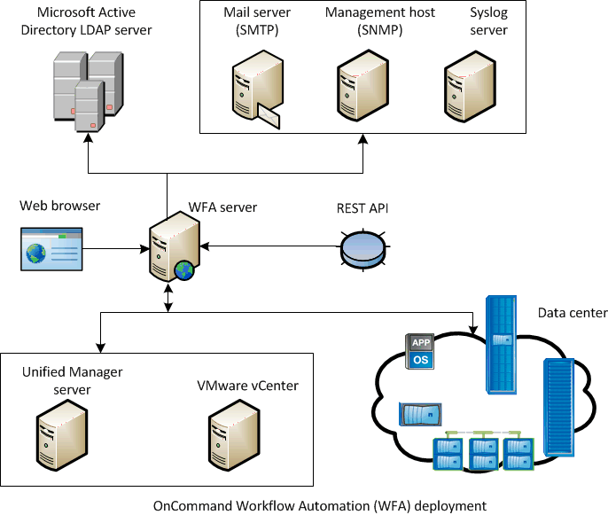

= 部署架構OnCommand Workflow Automation
:allow-uri-read: 
:icons: font
:imagesdir: ../media/

[role="lead"]
安裝了物件（WFA）伺服器、可協調多個資料中心的工作流程作業。OnCommand Workflow Automation

您可以將WFA伺服器連線至數Active IQ Unified Manager 個VMware vCenter部署、集中管理自動化環境。

下圖顯示部署範例：

