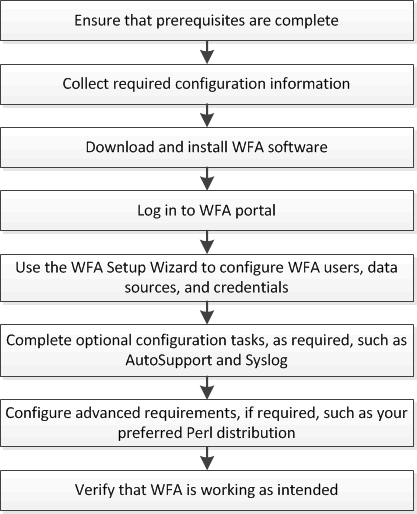

= 安裝與設定概述OnCommand Workflow Automation
:allow-uri-read: 
:icons: font
:imagesdir: ../media/

[role="lead"]
安裝OnCommand Workflow Automation 功能（WFA）包括執行各項工作、例如準備安裝、下載WFA安裝程式、以及執行安裝程式。安裝完成後、您可以設定WFA以符合需求。

下列流程圖說明安裝與組態工作：

