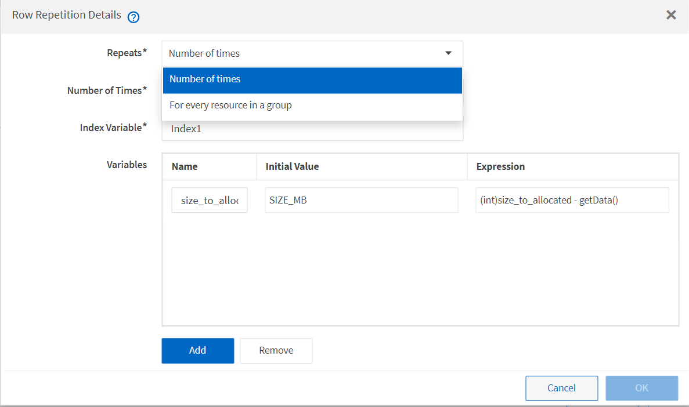
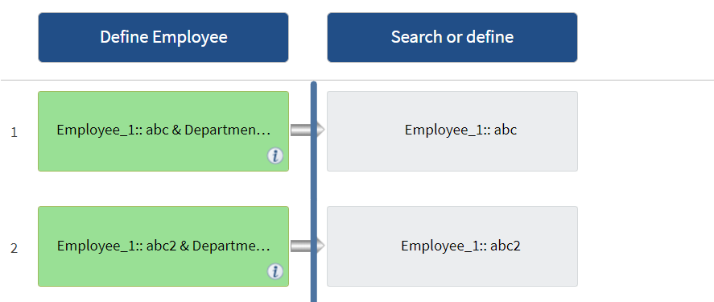

= 重複列的運作方式
:allow-uri-read: 
:icons: font
:imagesdir: ../media/

[role="lead"]
工作流程包含以列排列的命令和命令詳細資料。您可以根據搜尋準則的結果、在一列中指定要重複執行的命令、以取得固定次數的迭代或動態迭代次數。

您可以指定一列中的命令詳細資料來重複執行特定次數或設計工作流程。工作流程也可以設計成在執行或排程執行工作流程時、指定必須重複列的次數。您可以指定物件的搜尋條件、而且一列中的命令可設定為重複多次、如同搜尋條件所傳回的物件一樣。也可以將列設定為在符合特定條件時重複。

== 列重複變數

您可以在變數清單中指定可在列迭代期間處理的變數。對於變數、您可以指定名稱、初始化變數的值、以及在每次重複資料列之後評估的MVFlex運算式語言（MVEL）運算式。

下圖顯示重複列選項和列重複變數範例：

== 重複列與核准點

當您為命令指定重複列的迭代並包含核准點時、會在核准點之前執行命令的所有迭代。核准核准點之後、會繼續執行後續命令的所有迭代、直到下一個核准點為止。

下圖顯示當工作流程中包含核准點時、重複列的迭代如何執行：

== 在預先定義的工作流程中重複列範例

您可以在Designer中開啟下列預先定義的工作流程、以瞭解重複列的使用方式：

* 建立叢集Data ONTAP 式的SFC NFS Volume
* 在叢集Data ONTAP 式的VMware Infrastructure儲存設備上建立VMware NFS資料存放區
* 建立叢集對等關係
* 移除叢集Data ONTAP 式的「叢集式」功能

