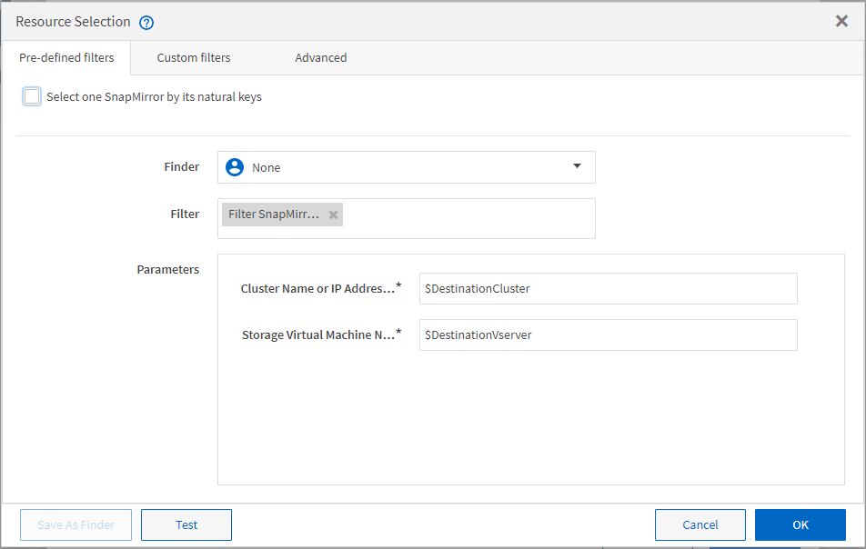

= 資源選擇的運作方式
:allow-uri-read: 
:icons: font
:imagesdir: ../media/

[role="lead"]
利用搜尋演算法來選擇執行工作流程的儲存資源。OnCommand Workflow Automation您應該瞭解資源選擇的運作方式、以便有效設計工作流程。

WFA使用搜尋演算法來選取字典項目資源（例如vFiler單元、集合體和虛擬機器）。然後使用選取的資源來執行工作流程。WFA搜尋演算法是WFA建置區塊的一部分、包括微調工具和篩選器。若要尋找並選取所需的資源、搜尋演算法會搜尋從Active IQ Unified Manager 不同儲存庫快取的資料、例如：VMware vCenter Server和資料庫。根據預設、每個字典項目都有一個篩選器可供使用、以便根據資源的自然金鑰來搜尋資源。

您應該為工作流程中的每個命令定義資源選取準則。此外、您也可以使用搜尋工具、在工作流程的每一列中定義資源選取準則。例如、當您建立需要特定儲存空間量的磁碟區時、可以使用「Create Volume」命令中的「Find Aggregate by Available cape流量」（依可用容量尋找Aggregate）尋找工具、以選取具有特定可用空間量的集合體、並在其中建立磁碟區。

您可以定義一組用於字典項目資源的篩選規則、例如vFiler單元、集合體和虛擬機器。篩選規則可以包含一或多個規則群組。規則包含一個字典項目屬性、運算子和一個值。屬性也可以包含其參照的屬性。例如、您可以指定集合體規則、如下所示：列出名稱開頭為字串「'aggr'」且可用空間超過5 GB的所有集合體。群組中的第一條規則是屬性「'name'」、運算子「'-tar-with」和值「'aggr'」。同一群組的第二個規則是屬性「可用的_size_MB"、運算子「'>'」和值「'5000」。您可以定義一組篩選規則以及公用篩選器。如果您已選取尋找器、則「定義篩選規則」選項會停用。如果您已選取「定義篩選規則」核取方塊、則「另存新檔尋找工具」選項會停用。

除了篩選器和搜尋器之外、您也可以使用搜尋或定義命令來搜尋可用的資源。與No-op命令相比、搜尋或定義命令是首選選項。搜尋與定義命令可用來定義認證的字典項目類型和自訂的字典項目類型的資源。搜尋或定義命令會搜尋資源、但不會對資源執行任何動作。但是、當使用搜尋器搜尋資源時、會在命令的內容中使用、而命令所定義的動作會在資源上執行。搜尋或define命令傳回的資源會做為工作流程中其他命令的變數。

下圖顯示篩選器用於資源選取：

== 預先定義工作流程中的資源選取範例

您可以在Designer中開啟下列預先定義工作流程的命令詳細資料、以瞭解如何使用資源選取選項：

* 建立叢集Data ONTAP 式的SFC NFS Volume
* 建立叢集對等關係
* 移除叢集Data ONTAP 式的「叢集式」功能

