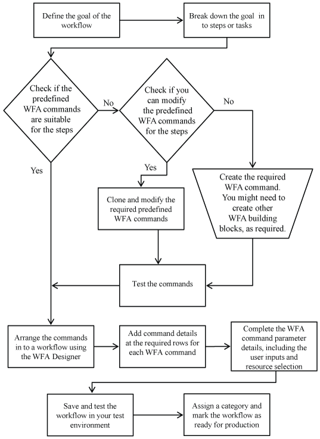

= 建立工作流程所涉及的工作
:allow-uri-read: 
:icons: font
:imagesdir: ../media/

[role="lead"]
在OnCommand Workflow Automation WFA（WFA）中建立儲存自動化工作流程、包括定義工作流程要執行的步驟、以及使用WFA建置區塊建立工作流程、例如命令、查找工具、篩選器和字典項目。

下列流程圖說明工作流程建立程序：

