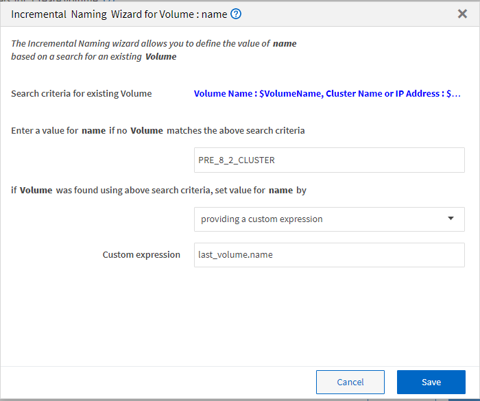

= 什麼是遞增命名
:allow-uri-read: 
:icons: font
:imagesdir: ../media/

[role="lead"]
遞增命名是一種演算法、可讓您根據參數的搜尋結果命名工作流程中的屬性。您可以根據遞增值或自訂運算式來命名屬性。遞增式命名功能可協助您根據需求實作命名慣例。

您可以在設計工作流程時使用遞增命名功能、動態命名工作流程所建立的物件。此功能可讓您使用資源選取功能來指定物件的搜尋條件、而搜尋條件所傳回的值則用於物件的屬性。此外、如果在指定的搜尋條件中找不到任何物件、您也可以指定屬性的值。

您可以使用下列其中一個選項來命名屬性：

* 提供增量值和後置
+
您可以提供應搭配搜尋準則所找到之物件值使用的值、並以您指定的數字遞增。例如、如果您想要建立命名慣例為「檔案管理器名稱獨特編號環境」的磁碟區、您可以使用尋找工具、以名稱前置碼尋找最後一個磁碟區、並將唯一編號增加1、並將後置名稱新增至磁碟區名稱。如果找到的最後一個Volume名稱前置碼是_Vf_023___ prod、而您正在建立三個Volume、則所建立的Volume名稱為_Vf_024_prod、Vf_025_prod和Vf_026__ prod。

* 提供自訂運算式
+
您可以提供應與搜尋準則所找到之物件值一起使用的值、並根據您輸入的運算式新增其他值。例如、如果您想要以「Last Volume name_enerit派1」的命名慣例來建立磁碟區、您可以輸入「last_volume.name +'_'+ nextName（「lab1」）」這個運算式。如果最後找到的Volume名稱是Vf_023_、則所建立Volume的名稱為_Vf_023_lab2_。

下圖顯示如何提供自訂運算式來指定命名慣例：

