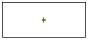
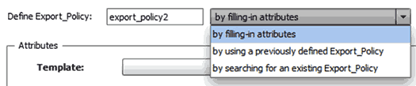

= 建立工作流程
:allow-uri-read: 
:icons: font
:imagesdir: ../media/

[role="lead"]
您可以使用Workflow Automation（WFA）來建立工作流程、以執行資料庫或檔案系統的資源配置、移轉及汰換儲存設備等工作。當預先定義的WFA工作流程不符合您的需求時、您應該建立工作流程。

.您需要的是 #8217 ；需要的是什麼
* 您必須已瞭解WFA建置組塊的概念。
* 您必須瞭解工作流程所需的功能、例如重複列、核准點和資源選擇。
* 您必須完成工作流程所需的規劃、包括工作流程需求檢查清單。
* 您應該已經建立說明內容、以便將工作流程的相關資訊提供給儲存操作員。

每個工作流程的架構可能會因工作流程的目標和需求而有所不同。此工作不會提供特定工作流程的指示、但會提供建立工作流程的一般指示。

.步驟
. 按一下*工作流程設計*>*工作流程*。
. 按一下 image:../media/new_wfa_icon.gif["新圖示"] 在工具列上。
. 在* Workflow *（工作流程）標籤中、執行下列步驟：
+
.. 展開所需的架構、然後按兩下所需的  （命令）或  （工作流程）。
+
您可以視需要重複此步驟。您可以拖放步驟、以重新排列工作流程編輯器中的步驟。

.. *選填：*按一下  新增所需的列數、以指定執行步驟的詳細資料。
+
每個步驟都會根據指定列和欄的指定步驟詳細資料執行。這些步驟會從左到右、從上到下順序執行。

.. 將游標放在您新增的步驟下方、然後按一下  若要新增步驟執行的步驟詳細資料、請至所需的列。
+
[cols="2*"]
|===
| 針對此步驟... | 執行此動作... 

 a| 
工作流程
 a| 
在「*工作流程*」標籤中輸入所需的使用者輸入、並在「*進階*」標籤中輸入所需條件。

 a| 
命令
 a| 
在「參數」的<command>索引標籤中、按一下每個物件索引標籤、選取所需的選項以定義物件屬性、然後在「進階」索引標籤和「其他參數」索引標籤中輸入所需的詳細資料。

 a| 
搜尋或定義
 a| 
選取應搜尋或定義的字典項目物件。

|===
+
下圖顯示定義物件屬性的可用選項：

+

+
選擇適當的行動：

+
[cols="2*"]
|===
| 適用於... | 執行此動作... 

 a| 
透過填寫屬性
 a| 
使用下列選項輸入屬性值：

*** 運算式
*** 變數
*** 使用者輸入
*** 資源選擇
*** 遞增命名

您必須將游標放在屬性欄位上、然後按一下  使用資源選擇或遞增命名功能。

 a| 
使用先前定義的「_object_」
 a| 
在選項清單前面的方塊中選取先前定義的「物件」。

 a| 
搜尋現有的「_object_」
 a| 
... 按一下*輸入搜尋條件*、以使用資源選擇功能來搜尋物件。
... 如果找不到所需的物件、請選取執行所需的選項之一：
+
**** 中止工作流程
+
如果找不到特定物件、此選項會中止工作流程執行。

**** 停用此命令
+
 This option disables only the current step and executes the workflow.
**** 填寫「object」的屬性、然後執行命令
+
 This option enables you to enter the required attributes and execute the workflow.

|===

. 如果您要插入核准點、請按一下  並輸入核准點所需的註解。
+
核准點註解可以包含VEL運算式。

. 按一下  在行號旁邊執行以下操作：
+
** 插入一列。
** 複製列。
** 重複此列。
+
您可以使用下列其中一個選項來指定命令參數的重複性：

+
*** 次數
+
您可以使用此選項針對指定的重複次數重複執行命令。例如、您可以指定重複執行三次「Create qtree」命令、以建立三個qtree。

+
您也可以將此選項用於動態執行命令的次數。例如、您可以為要建立的LUN數目建立使用者輸入變數、並在執行或排程工作流程時使用儲存設備操作員指定的編號。

*** 針對群組中的每個資源
+
您可以使用此選項、然後為物件指定搜尋條件。命令重複的次數與搜尋條件傳回的物件相同。例如、您可以搜尋叢集中的節點、然後針對每個節點重複執行「Create iSCSI邏輯介面」命令。

** 新增執行該列的條件。
** 移除該列。

. 在「*詳細資料*」標籤中、執行下列步驟：
+
.. 在「*工作流程名稱*」和「*工作流程說明*」欄位中指定必要資訊。
+
每個工作流程的工作流程名稱和說明都必須是唯一的。

.. *選用：*指定實體版本。
.. *可選：*如果您不想使用保留功能、請清除*考慮保留的元素*核取方塊。
.. *選用：*如果您不想啟用具有相同名稱之元素的驗證、請清除*啟用元素存在驗證*核取方塊。

. 若要編輯使用者輸入、請執行下列步驟：
+
.. 按一下*使用者輸入*索引標籤。
.. 按兩下您要編輯的使用者輸入。
.. 在*編輯變數：*對話方塊中、編輯使用者輸入。

. 若要新增常量、請執行下列步驟
+
.. 按一下「*常量*」索引標籤、然後使用「*新增*」按鈕來新增工作流程所需的常量。
+
當您使用通用值來定義多個命令的參數時、可以定義常量。例如、請參閱「Create、map and Protect LUNs with SnapVault the示例」工作流程中使用的Aggregate過度使用者承諾臨界值常量。

.. 輸入每個常量的名稱、說明和值。

. 按一下「*返回參數*」索引標籤、然後使用「*新增*」按鈕、為工作流程新增必要的參數。
+
當工作流程規劃與執行必須在規劃期間傳回某些已計算或選取的值時、您可以使用傳回參數。您可以在工作流程預覽的監控視窗的「傳回參數」索引標籤中、或在工作流程執行完成之後、檢視已計算或選取的值。

+
Aggregate：您可以將Aggregate指定為傳回參數、以查看使用資源選取邏輯選取的Aggregate。

+
如果您已在工作流程中加入子工作流程、且子工作流程傳回的參數名稱包含空格、美元符號（$）、 或者、您應該在父工作流程的方括弧內指定傳回參數名稱、以檢視父工作流程中的子工作流程傳回參數值。

+
[cols="2*"]
|===
| 如果參數名稱為... | 指定為... 

 a| 
《ChildWorkflow1.abc$Value》
 a| 
「ChildWorkflow1["abc$"+"value"」

 a| 
《ChildWorkflow1.$Value》
 a| 
「ChildWorkFlow1["$"+"值"]」

 a| 
《ChildWorkflow1.Value$》
 a| 
《ChildWorkflow1.Value$》

 a| 
《ChildWorkflow1.P N》
 a| 
「ChildWorkflow1["P N"]」

 a| 
「ChildWorkFlow1.reture_strat（「HW」）」
 a| 
「ChildWorkflow1["reture_string(\"hbd\")"]」

|===
. *選用：*按一下「*說明內容*」索引標籤、即可新增您為工作流程所建立的說明內容檔案。
. 按一下「*預覽*」、確認工作流程的規劃已順利完成。
. 按一下「*確定*」以關閉預覽視窗。
. 按一下「 * 儲存 * 」。

== 完成後

在測試環境中測試工作流程、然後在*工作流程名稱_*>*詳細資料_*中將工作流程標記為已準備好正式作業。
